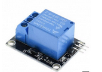
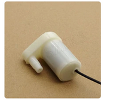

# Proyecto Huerto
Con este proyecto se pretende automatizar el riego.
Ademas se quiere la compatibilidad tanto en un entorno con una placa ArduinoUno como con una placa NodeDCU

## Componentes
* **Rele**, para el control del apagado y encendido de la bomba, es de 10v + 1out

  
  
Las entradas son: 
  **NO** = Entrada positiva del dispositivo 
  **COM** = Entrada positiva de la fuente de alimentación 
  **NC** = sin nada
  

* **Bomba**, encargada de proporcionar el agua, esta ira conectada al rele, para que controle su encendido y apagado

  

* **Bateria**, para dar energia al sistema lo que vamos a usar en este caso es una bateria conectada a una placa solar

## Esquema del proyecto
