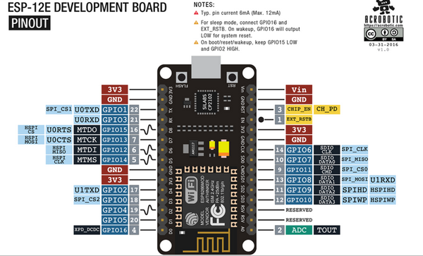

# NodeMCU
En los proyectos con el modulo NodeMCU siempre se tienen que inicializar de esta manera para poder ver las trazas de forma correcta:
```c++
    void setup() {
      //Inicializacion logs
      Serial.begin(115200);
    }
```
En el caso en el que no la podamos ver en la consola se tendra que realizar la selaccion de "Ambos NL & CL" y con la frecuencia "115200 baud".<br>

La placa tendra el siguiente esquema con los pins que vamos a usar
<div style="display: flex; align-items: center; margin-bottom: 20px;">
  
</div>

Si queremos mas informacion sobre el [modelo](https://www.luisllamas.es/detectar-obstaculos-con-sensor-infrarrojo-y-arduino/). 

En esta [pagina](https://www.luisllamas.es/detectar-obstaculos-con-sensor-infrarrojo-y-arduino/) se explica muy bien los sensores, tanto el duncionamiento como la conexion que tienen que tener. 

## Utilidades
### Dispositivos
- **Bomba de agua**, utilidad para el manejo del agua [ver](util/dispositivos/README.md#rele--bomba-de-agua)
### Modulo
- **Wifi Manager**, utilidad que gestiona la wifi [ver](util/modulo/README.md#conexion-wifi)
- **Power Manager**, utilidad que gestiona el ahorro de energia [ver](util/modulo/README.md#poner-en-suspension-dispositivo)
- **IFTT**, utilidad que gestiona el control y envio de mensajes para el tratamiento IFTT
### Sensores
- **DHT22**, sensor de humedad y temperatura ambiente [ver](util/sensores/README.md#sensor-dht22)
- **YL69**, sensor de humedad en el suelo [ver](util/sensores/README.md#sensor-yl69)
- **LDR**, sensor de luminiscencia [ver](util/sensores/README.md#sensor-ldr)
- **Hc-SR04**, sensor ultrasonidos [ver](util/sensores/README.md#sensor-hc-sr04)
- **inflarrojos**, sensor inflarrojos [ver](util/sensores/README.md#sensor-inflarrojos)
### otros

## Proyectos de ejemplo
- **Proyecto 1**, Lectura de la humedad y temperatura ambiente por medio del sensor DHT22.<br>
Creacion de un cliente. Uso del protocolo IFTTT
- **Proyecto huerto**, simulamos un huerto. [Descripcion](proyectoHuerto/README.md)
- **wifi**, ejemplo del manejo de la wifi, proyecto en el que nos conectamos a nuestra propia wifi y realizamso la solicitud de un dato, para luego mostrarlo.
