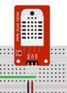

# Proyecto Huerto
Con este proyecto se pretende automatizar el riego con una placa NodeDCU.

## Componentes
* **Sensor DHT22**, con este sensor se puede recuperar la temperatura y la humedad ambiente. 
No es necesario para este proyecto, pero con el podremos recuperar datos del ambiente.

  
  
Las entradas son: 
  **DAT** = Salida de datos del control, el que nos informa 
  **VCC** = Alimentacion, no necesita extra, se peude conectar a 3v o 5v 
  **GND** = Alimentacion, tierra
  

* **Sensor YL69**, con este sensor se controla la humedad de la tierra, consta de dos componentes, el primero que se clavaria en la tierra (es el que es en forma de U) y el segundo componente que es el que realiza el procesamiento

  
  
Las entradas son: 
  **A0** = Salida de datos del control, el que nos informa 
  *D0** = sin nada 
  **VCC** = Alimentacion, no necesita extra, se peude conectar a 3v o 5v 
  **GND** = Alimentacion, tierra
  

* **Rele**, para el control del apagado y encendido de la bomba, es de 10v + 1out

  
  
Las entradas son: 
  **NO** = Entrada positiva del dispositivo 
  **COM** = Entrada positiva de la fuente de alimentación 
  **NC** = sin nada
  

* **Bomba**, encargada de proporcionar el agua, esta ira conectada al rele, para que controle su encendido y apagado

  

* **Bateria**, para dar energia al sistema lo que vamos a usar en este caso es una bateria conectada a una placa solar

## Esquema del proyecto
