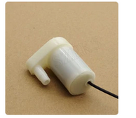

# DISPOSITIVOS
En esta carpeta se encuentran otros dispositivos

## Rele + bomba de agua
Con el rele lo que hacemos es controlar el apagado y encendido de la bomba de agua.<br> 
El código se encuentra en el fichero **bombaAgua.hpp**. Existen dos variables que se pueden modificar: <br>
* **timer_bomba (int)**, Nos indica el tiempo en el que el dispositivo esta activado (tiempo de riego).
* **nombre (String)**, Nombre del dispositivo, ya que podriamos tener varios de ellos y asi los podemos identificar. <br>

<br>La forma de llamarlo es: <br>

```c++
    //Informacion del pin donde se conecta
     #define RELE_1 D3
    //Nos indica el tiempo de riego
    const int T_BOMBA=7000;

    BombaAgua bombaAgua;

    void setup(){
      bombaAgua.init(RELE_1, "bomba1", T_BOMBA);
    }

    void loop(){
      // TODO PONER EL CODIGO QUE SE QUIERA, metodos
      // Modificar variables
      sensorYL69.setTiempoRiego(8622);
      sensorYL69.setNombre("prueba2")
      // Apagado y encendido
      bombaAgua.releON();
      bombaAgua.releOFF();
      // Iniciamos el riego
      bombaAgua.iniciarRiego();
    }
```
### El sensor:
Con este dispositivo, si que es necesario una fuente de alimentacion extra.
<span style="color: red;">10v + 1out</span>
<div style="display: flex; align-items: center; margin-bottom: 20px;">
  
  <p>Las entradas son:<br/>
  **NO** = Entrada positiva del dispositivo<br/>
  **COM** = Entrada positiva de la fuente de alimentación<br/>
  **NC** = sin nada
  </p>
</div>
Y esta seria la bomba de agua:
<div style="display: flex; align-items: center; margin-bottom: 20px;">
  
</div>
