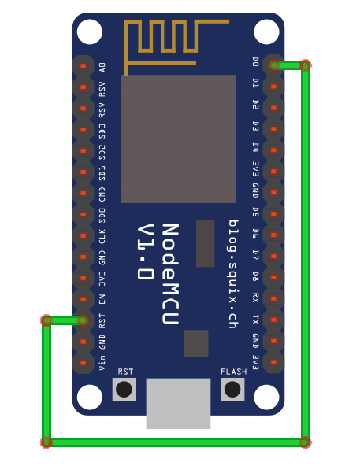
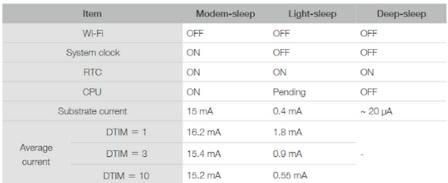

# MODULO
En esta carpeta se encuentran procesos propios del dispositivo

## Conexion wifi
Con la lcase **wifiManager.hpp** se puede controlar el manejo de la wifi, asi como el envio de ella.

### Conexion a la misma wifi
Si nos queremos conectar a la misma wifi que tenemos en casa, tendremos que usarla en modo **WIFI_STA**.<br>

Esto es un ejemplo:
```c++
#include "wifiManager.hpp"

#define SSID "<Nombre de la red>"
#define PWD "<contraseña>"

WiFiManager wifi;

void setup() {
  //Inicializacion logs
  Serial.begin(115200);
  delay(1000);

  // Conectarse a WiFi
  wifi.initSTA(SSID, PWD);
}

void loop() {
  // Atender peticiones
  wifi.handleClient(<Mandar el HTML que se quiera>);
}
```

### Crear nuestra propia wifi
Si queremos crear nuestra propia wifi, para ello tendremos que usar el modo **WIFI_AP**.<br>

Esto es un ejemplo:
```c++
#include "wifiManager.hpp"

#define SSID "<Nombre de la red>"
#define PWD "<contraseña>" // Contraseña (mínimo 8 caracteres)

WiFiManager wifi;

void setup() {
  //Inicializacion logs
  Serial.begin(115200);
  delay(1000);

  // Conectarse a WiFi
  wifi.initAP(SSID, PWD);
}

void loop() {
  // Atender peticiones
  wifi.handleClient(<Mandar el HTML que se quiera>);
}
```
### Apagado
Si queremos realizar el apagado del dispositivo wifi para ahorra energia.<br>

Esto es un ejemplo:
```c++
#include "wifiManager.hpp"

WiFiManager wifi;

void setup() {
  //Inicializacion logs
  Serial.begin(115200);

  // Desconectar la WiFi
  delay(5000);
  wifi.wifiOff();
}

void loop() {
}
```

En cambio si no se quiere apagar, se puede poner un modo para el ahorro de energia, estos serian de la siguiente manera:
- WIFI_NONE_SLEEP: para poner modo activo, sin ahorro de energia. <span style="color: red;">56 mA - 170 mA</span>
- WIFI_LIGT_SLEEP: para poner modo sueño ligero. <span style="color: red;">0,9 mA</span>
- WIFI_MODEM_SLEEP: para poner modo modem suspendido. <span style="color: red;">15 mA</span>

```c++
  WiFi.setSleepMode(modo);
```

## Poner en suspension dispositivo
Con la clase **powerManager.hpp** se puede controlar el ahorro de energia mediante el apagado del microprocesador. Con esto la energia que consume es de <span style="color: red;">20 µA</span>, este es el llamado **deep sleep**.<br>
Para este tipo de apagado ademas se tiene que configurar la parte hardware del dispositivo, y para ello lo que tendremos que hacer es conectar el pin GPIO 16 (D0) con el pin RST (reset), esto es muy importante para que se pueda realizar el rearranque del dispositivo.<br>
<br>
<br>
<span style="background-color: grey;">**!Importante:** Antes de cargar el código desconecta el pin RST del pin GPIO 16 ya que esto no permite que el código se cargue en la placa desde el IDE de Arduino</span>.<br>
<span style="background-color: grey;">**!Nota** Todo el código que está después de llamar a la función ESP.deepSleep(20e6), no se ejecuta ya que una vez entra en el modo ESP8266 deep sleep, el microcontrolador se duerme y deja de ejecutar las siguientes sentencias. Cuando se despierta, empieza por el principio del código.</span>.<br>

Esto es un ejemplo:
```c++
  #include "powerManager.hpp"

  PowerManager power;

  void setup() {
    //Inicializacion logs
    Serial.begin(115200);
    delay(1000);

    // Indicamos los segundos que queremos que este apagado
    power.deepSleepSec(60);
  }
```
