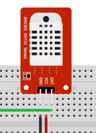
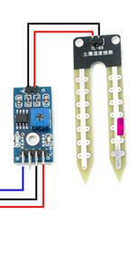
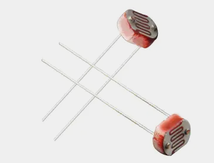
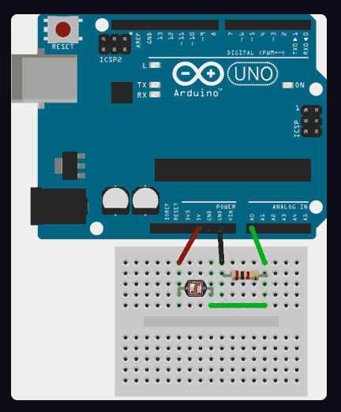

# SENSORES
En esta carpeta se encuentran los sensores

## Sensor DHT22
Es un sensor con el que se puede recuperar la temperatura y la humedad ambiente.<br> 
El código se encuentra en el fichero **sensorDHT22.hpp**. Para esta clase es necesario importar la libreria **DHTesp.h** y la forma de llamarlo es: <br>
```c++
    //Informacion del pin donde se conecta
    #define SENSOR_DHT22 D1

    SensorDHT22 sensorDHT22;

    void setup(){
      sensorDHT22.init(SENSOR_DHT22);
    }

    void loop(){
      // TODO PONER EL CODIGO QUE SE QUIERA, metodos
      // Metodo para la lectura de toda la informacion
      TempAndHumidity datos = sensorDHT22.leer();
      // Metodo para recuperar la temperatura o la humedad
      float t = sensorDHT22.getTemperatura();
      float h = sensorDHT22.getHumedad();
      // Metodo para mostrar la informacion por la consola
      sensorDHT22.toConsole(datos);
      // Metodo para generar html con la informacion
      String html = sensorDHT22.toHtml(datos);
    }
```
### El sensor:
En este sensor no es necesario una fuente extra de alimentacion 
<div style="display: flex; align-items: center; margin-bottom: 20px;">
  
  <p>Las entradas son:<br/>
  **DAT** = Salida de datos del control, el que nos informa<br/>
  **VCC** = Alimentacion, no necesita extra, se peude conectar a 3v o 5v<br/>
  **GND** = Alimentacion, tierra
  </p>
</div>

## Sensor YL69
Es un sensor con el que se puede recuperar la humedad del suelo.<br> 
El código se encuentra en el fichero **sensorYL69.hpp**. Existen dos variables que se pueden modificar: <br>
* **humbral (int)**, Nos indica el humbrar que le damos al sensor para que este nos indique si la tierra esta humeda o no.
* **nombre (String)**, Nombre del dispositivo, ya que podriamos tener varios de ellos y asi los podemos identificar. <br>

La forma de llamarlo es: <br>
```c++
    //Informacion del pin donde se conecta
    #define SENSOR_YL69 D2
    //Nos indica el humbrar de humedad (para la sensibilidad del sensor)
    const int DEFAULT_HUMBRAL=800;

    SensorYL69 sensorYL69;

    void setup(){
      sensorYL69.init(SENSOR_YL69, "planta1", DEFAULT_HUMBRAL);
    }

    void loop(){
      // TODO PONER EL CODIGO QUE SE QUIERA, metodos
      // Modificar variables
      sensorYL69.setHumbral(8622);
      sensorYL69.setNombre("prueba2")
      // Recuperar los valores de humedad
      float h = sensorYL69.getHumedad();
      // Metodo para mostrar la informacion por la consola
      sensorYL69.toConsole(h);
      // Metodo para generar html con la informacion
      String html = sensorYL69.toHtml(h);
    }
```
### El sensor:
En este sensor no es necesario una fuente extra de alimentacion 
<div style="display: flex; align-items: center; margin-bottom: 20px;">
  
  <p>Las entradas son:<br/>
  **A0** = Salida de datos del control, el que nos informa<br/>
  *D0** = sin nada<br/>
  **VCC** = Alimentacion, no necesita extra, se puede conectar a 3v o 5v<br/>
  **GND** = Alimentacion, tierra
  </p>
</div>

## Sensor LDR
Con este sensor podemo ver la canditad de luz que tenemos. El código se encuentra en el fichero **sensorLDR.hpp**.<br>
<span style="background-color: grey;">**!Importante:** En este caso la conexion es a un pin analógico</span><br>

La forma de llamarlo es: <br>
```c++
  #include "SensorLDR.hpp"

  //Informacion del pin donde se conecta
  #define PIN_LDR A0    //Seleccionamos el pin analógico A0 como input del sensor LDR. 

  SensorLDR sensorLdr;

  void setup() { 
    Serial.begin(9600); //Inicializamos monitor serie para visualizar los valores de LDR. 
    sensorLdr.init(PIN_LDR);
  }

  void loop() { 
    delay(1000);                          // esperar un segundo  

    int valor = sensorLdr.lecturaNormal();
    sensorLdr.toConsole(valor);
    sensorLdr.toConsole(sensorLdr.lecturaNivelLuz(valor));
  }
```
### El sensor:
En este sensor no es necesario una fuente extra de alimentacion, pero si que es necesario que se ponga una resistencia para el correcto funcionamiento. <br>

<br>
